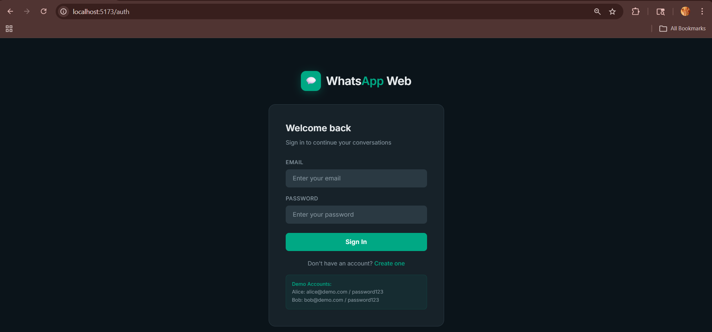
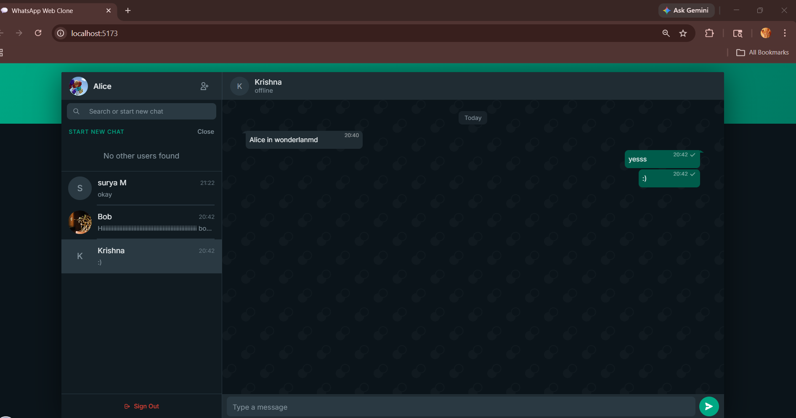
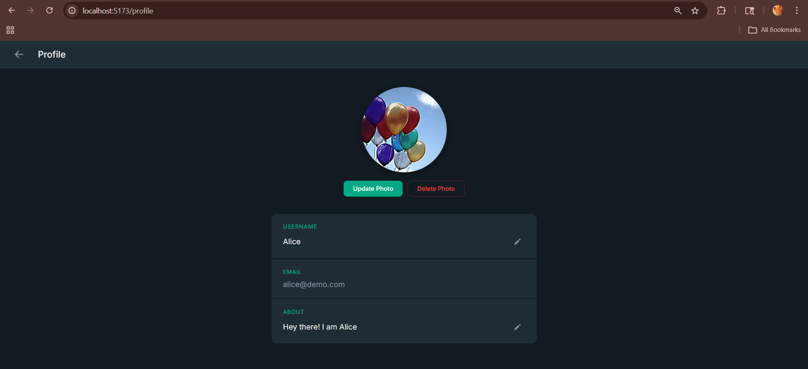
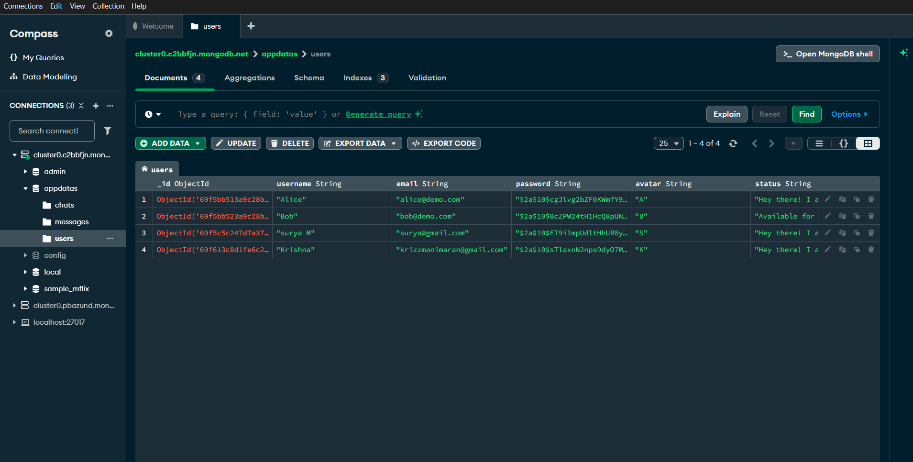
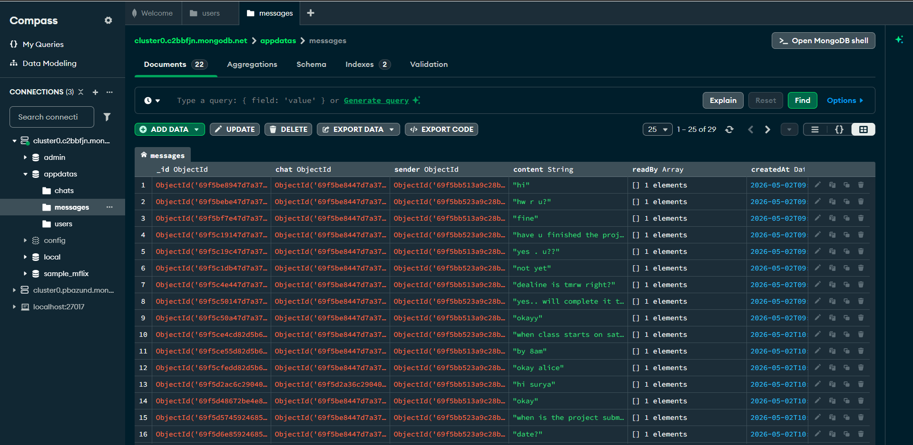
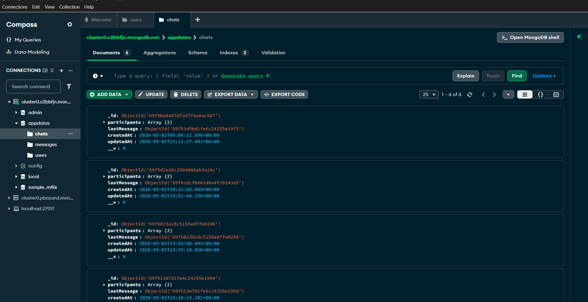

# WhatsApp Web Clone

A full-stack real-time messaging application built with the MERN stack and Socket.IO, replicating core WhatsApp Web functionality.

## Features

- Real-time messaging with Socket.IO
- User authentication (JWT)
- Profile page with picture upload/update/delete
- Online/offline status indicators
- Typing indicators
- Message timestamps and read receipts
- Responsive WhatsApp-themed dark UI
- Profile pictures visible to all users

## Tech Stack

| Layer     | Technology                          |
|-----------|-------------------------------------|
| Frontend  | React 18, Vite, React Router, Axios |
| Backend   | Node.js, Express                    |
| Database  | MongoDB Atlas (Mongoose)            |
| Realtime  | Socket.IO                           |
| Auth      | JWT, bcryptjs                       |

## Project Structure

```
whatsapp_AG/
├── client/                 # React frontend (Vite)
│   └── src/
│       ├── components/     # Sidebar, ChatWindow, ChatList, Auth
│       ├── context/        # AuthContext, SocketContext
│       ├── pages/          # AuthPage, ChatPage, ProfilePage
│       └── services/       # API service (Axios)
├── server/                 # Express backend
│   ├── config/             # Database connection
│   ├── middleware/          # JWT auth middleware
│   ├── models/             # User, Chat, Message schemas
│   ├── routes/             # auth, users, chats, messages
│   └── socket/             # Socket.IO event handlers
└── README.md
```

## Prerequisites

- [Node.js](https://nodejs.org/) v18 or higher
- [MongoDB Atlas](https://www.mongodb.com/atlas) account (M0 tier - free tier works)
- Git

## Getting Started

### 1. Clone the repository

```bash
git clone https://github.com/<your-username>/whatsapp_AG.git
cd whatsapp_AG
```

### 2. Setup the backend

```bash
cd server
npm install
```

Create a `.env` file in the `server/` directory (use `.env.example` as a template):

```bash
cp .env.example .env
```

Edit `server/.env` with your MongoDB Atlas connection string:

```env
PORT=5000
MONGODB_URI=mongodb+srv://<username>:<password>@<cluster>.mongodb.net/<dbname>?retryWrites=true&w=majority
JWT_SECRET=your_jwt_secret_key_here
```

### 3. Seed demo users (optional)

```bash
cd server
npm run seed
```

This creates two demo accounts:
- **Alice**: alice@demo.com / password123
- **Bob**: bob@demo.com / password123

### 4. Setup the frontend

```bash
cd client
npm install
```

### 5. Run the application

Open **two terminals**:

**Terminal 1 — Backend:**
```bash
cd server
npm start
```

**Terminal 2 — Frontend:**
```bash
cd client
npm run dev
```

### 6. Open in browser

- Frontend: [http://localhost:5173](http://localhost:5173)
- API: [http://localhost:5000/api](http://localhost:5000/api)

## Usage

1. Register a new account or log in with demo credentials
2. Click the **+** icon in the sidebar to start a new chat
3. Select a user to begin messaging
4. Click your avatar (top-left) to access the **Profile page**
5. Upload, update, or delete your profile picture from the profile page

## MongoDB Atlas Setup

1. Go to [MongoDB Atlas](https://www.mongodb.com/atlas)
2. Create a free cluster
3. Create a database user with a password
4. Whitelist your IP (or use `0.0.0.0/0` for development)
5. Get your connection string and paste it in `server/.env`

## Screenshots

### Login Page


### Chat Interface


### Profile Page


### Users Collection


### Messages Collection


### Chats Collection

